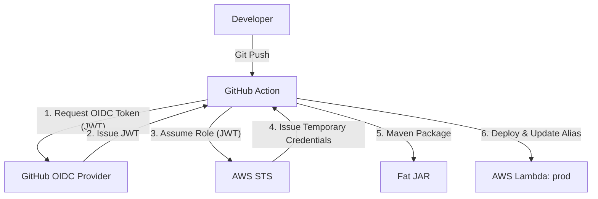

# Deployment Guide: AWS Lambda CI/CD (GitHub Actions + Java)

This guide details the setup for automatically deploying your compiled Java JAR (`ChartGeneratorLambdaFunction-1.1-SNAPSHOT.jar`) directly to your existing AWS Lambda function upon code pushes to the `main` branch. 

To eliminate the need for permanent, high-risk AWS Access Keys, this pipeline uses **OpenID Connect (OIDC) Workload Identity Federation**.

---

## Architecture Overview



---

## Step 1: Set up AWS OpenID Connect (OIDC) Trust Relationship

OIDC allows GitHub Actions to assume a temporary IAM Role directly from AWS Security Token Service (STS) without needing standard API key secrets.

### A. Create the OIDC Identity Provider in AWS (One-time Setup)
1. Open the **AWS IAM Console**.
2. Select **Identity Providers** on the left menu, then click **Add provider**.
3. Choose **OpenID Connect**.
4. For **Provider URL**, enter: `https://token.actions.githubusercontent.com`
5. Click **Get thumbprint** to verify the provider.
6. For **Audience**, enter: `sts.amazonaws.com`
7. Click **Add provider**.

### B. Create the Deployment IAM Role
1. In the **AWS IAM Console**, go to **Roles** -> **Create role**.
2. Select **Web Identity** as the trusted entity.
3. Select your OIDC Provider (`token.actions.githubusercontent.com`) and Audience (`sts.amazonaws.com`).
4. Click **Next**.
5. In the permissions screen, click **Create policy** to create a scoped permission set. Switch to the **JSON** editor and paste the following policy:

```json
{
    "Version": "2012-10-17",
    "Statement": [
        {
            "Effect": "Allow",
            "Action": [
                "lambda:UpdateFunctionCode",
                "lambda:UpdateAlias",
                "lambda:CreateAlias",
                "lambda:GetAlias",
                "lambda:GetFunctionConfiguration"
            ],
            "Resource": "arn:aws:lambda:<REGION>:<ACCOUNT_ID>:function:<LAMBDA_FUNCTION_NAME>"
        }
    ]
}
```
*(Replace `<REGION>`, `<ACCOUNT_ID>`, and `<LAMBDA_FUNCTION_NAME>` with your actual AWS settings).*

6. Save the policy as `GitHubActionsLambdaDeployPolicy`.
7. Go back to the role creation wizard, refresh, select `GitHubActionsLambdaDeployPolicy`, and click **Next**.
8. Name the role `GitHubActionsLambdaDeployRole`.
9. Modify the **Trust Relationship Policy** of the role to restrict access to only your repository and the `main` branch. Go to the **Trust relationships** tab of the created role, click **Edit trust policy**, and replace the content with:

```json
{
  "Version": "2012-10-17",
  "Statement": [
    {
      "Effect": "Allow",
      "Principal": {
        "Federated": "arn:aws:iam::<ACCOUNT_ID>:oidc-provider/token.actions.githubusercontent.com"
      },
      "Action": "sts:AssumeRoleWithWebIdentity",
      "Condition": {
        "StringEquals": {
          "token.actions.githubusercontent.com:aud": "sts.amazonaws.com"
        },
        "StringLike": {
          "token.actions.githubusercontent.com:sub": "repo:<GITHUB_USERNAME>/ChartGeneratorLambdaFunction:ref:refs/heads/main"
        }
      }
    }
  ]
}
```
*(Replace `<ACCOUNT_ID>` and `<GITHUB_USERNAME>` with your actual values).*

10. Save changes. Copy the **Role ARN** (e.g. `arn:aws:iam::123456789012:role/GitHubActionsLambdaDeployRole`).

---

## Step 2: Configure GitHub Repository Secrets

Add the following secrets under **Settings > Secrets and variables > Actions > Secrets**:

| Secret Name | Value |
| :--- | :--- |
| `AWS_ROLE_ARN` | The ARN of the IAM Role created in Step 1 (e.g. `arn:aws:iam::123456789012:role/GitHubActionsLambdaDeployRole`). |
| `AWS_REGION` | The region of your resources (e.g. `us-east-1`). |
| `AWS_LAMBDA_FUNCTION_NAME` | The exact name of your Lambda function (e.g., `ChartGeneratorLambdaFunction`). |

---

## Step 3: Create the GitHub Actions Workflow

Create a file named `.github/workflows/deploy-lambda.yml` in your repository with the following content:

```yaml
name: Deploy Java Lambda Function

on:
  push:
    branches:
      - main
    paths:
      - 'src/**'
      - 'pom.xml'
  workflow_dispatch: # Allows manual triggers

# Permissions block is required for OIDC authentication
permissions:
  id-token: write # Required for requesting the JWT
  contents: read  # Required for actions/checkout

jobs:
  deploy:
    runs-on: ubuntu-latest

    steps:
      # 1. Check out code
      - name: Checkout Code
        uses: actions/checkout@v5

      # 2. Set up Java 21 JDK
      - name: Set up JDK 21
        uses: actions/setup-java@v4
        with:
          java-version: '21'
          distribution: 'temurin'
          cache: maven

      # 3. Compile and Package "Fat JAR"
      - name: Build with Maven
        run: mvn clean package -DskipTests

      # 4. Authenticate to AWS via OIDC Role Assumption
      - name: Configure AWS Credentials
        uses: aws-actions/configure-aws-credentials@v4
        with:
          role-to-assume: ${{ secrets.AWS_ROLE_ARN }}
          aws-region: ${{ secrets.AWS_REGION }}

      # 5. Deploy JAR to Lambda and publish a new version
      - name: Update Lambda Function Code & Publish Version
        id: deploy-lambda
        run: |
          VERSION=$(aws lambda update-function-code \
            --function-name ${{ secrets.AWS_LAMBDA_FUNCTION_NAME }} \
            --zip-file fileb://target/ChartGeneratorLambdaFunction-1.1-SNAPSHOT.jar \
            --publish \
            --query 'Version' \
            --output text)
          echo "VERSION=$VERSION" >> $GITHUB_OUTPUT

      # 6. Point the 'prod' alias to the new version
      - name: Update Lambda Alias
        run: |
          # Try to update the alias. If it doesn't exist, create it.
          aws lambda update-alias \
            --function-name ${{ secrets.AWS_LAMBDA_FUNCTION_NAME }} \
            --name prod \
            --function-version ${{ steps.deploy-lambda.outputs.VERSION }} \
            || \
          aws lambda create-alias \
            --function-name ${{ secrets.AWS_LAMBDA_FUNCTION_NAME }} \
            --name prod \
            --function-version ${{ steps.deploy-lambda.outputs.VERSION }} \
            --description "Production environment alias"
```
