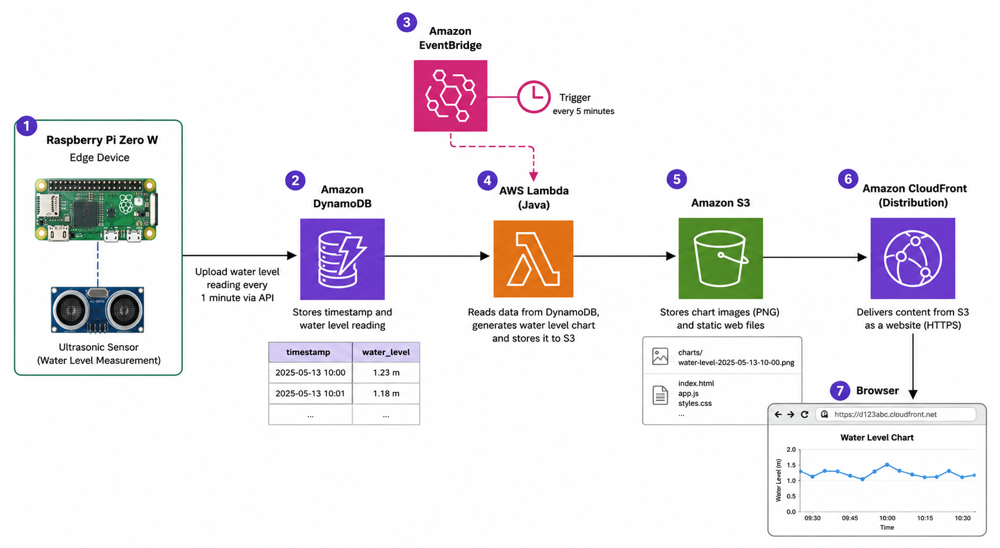
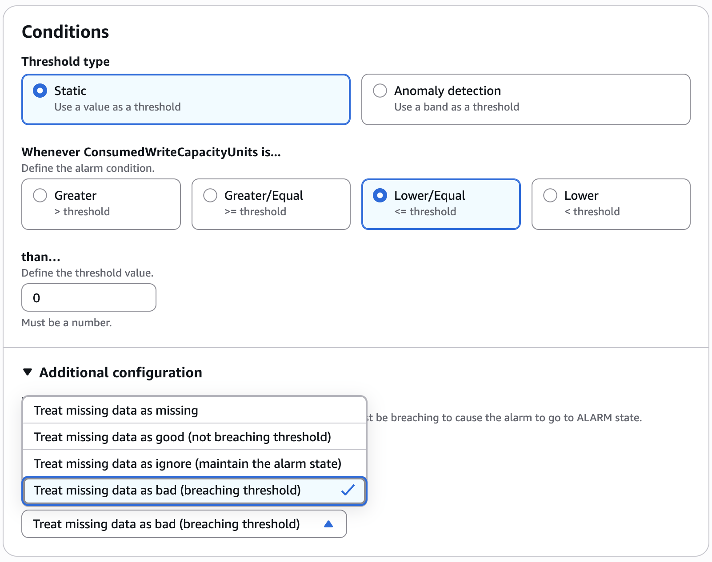

# ChartGeneratorLambdaFunction

An AWS Lambda function designed to automate the generation of sump pump water level charts from data stored in DynamoDB and serve them via S3.

## Purpose
This project migrates the original [SumpDataVisualizer CLI tool](https://github.com/nobudev7/SumpDataVisualizerCli) to a serverless architecture. It automatically do the following:
1.  Retrieves water level data for a specific date from a DynamoDB table.
2.  Generates a professional XY line chart (PNG) using JFreeChart.
3.  Uploads the chart to an S3 bucket with organized directory structures.
4.  Updates a central `file-list.json` on S3 to ensure the frontend website can discover new images immediately.

Note: The static website code is the same as in SumpDataVisualizer CLI [html folder](https://github.com/nobudev7/SumpDataVisualizerCli/tree/main/html).

## How it Works
-   **Trigger:** Can be triggered manually, on a schedule (Amazon EventBridge), or via other AWS services.
-   **Date Selection:** By default, it generates a chart for the current day. It can also be configured to generate a chart for "yesterday" or any specific date (see [Input Parameters](#input-parameters)).
-   **Data Retrieval:** Queries the `Sump_Water_Level` DynamoDB table using a partition key (`Date` in local `YYYYMMDD`) and a sort key (`Timestamp` in UTC ISO-8601 `YYYY-MM-DDTHH:MM:SSZ`). This local date + UTC timestamp approach ensures perfect data ordering even during Daylight Saving Time (DST) transitions, allowing for accurate 23, 24, or 25-hour charts.
-   **Chart Generation:** Uses `JFreeChart` to create a 1600x900 PNG image. The function automatically converts the UTC `Timestamp` back to the `America/New_York` timezone for human-readable X-axis labels. The image is processed entirely in memory (as a `byte[]`) to avoid Lambda filesystem limitations.
-   **Storage & Organization:**
    -   Images are stored at: `output/YYYY/MM/waterlevel-YYYYMMDD.png`
    -   Metadata is stored at: `output/file-list.json`
-   **Cache Management:** To ensure CloudFront serves fresh content without manual invalidations, the function sets a `Cache-Control: max-age=60` header on all S3 uploads.



## Input Parameters
The Lambda function accepts a JSON payload to control which date the chart is generated for:

| Parameter | Type | Value Example | Description |
| :--- | :--- | :--- | :--- |
| `target` | String | `"yesterday"` | Generates a chart for the previous day. |
| `date` | String | `"2026-05-10"` | Generates a chart for the specified `YYYY-MM-DD` date. |

**Example (Yesterday):**
```json
{ "target": "yesterday" }
```

**Example (Specific Date):**
```json
{ "date": "2026-05-15" }
```

If no parameters are provided, it defaults to the current day.

## AWS Lambda Setup & Scheduling

### Deployment
1.  **Build the JAR:** Run `mvn clean package`.
2.  **Create Lambda:** In the AWS Console, create a new Java 21 Lambda function.
3.  **Upload JAR:** Upload the `target/ChartGeneratorLambdaFunction-1.0-SNAPSHOT.jar`.
4.  **Handler Configuration:** Set the handler to `com.nobudev7.ChartGeneratorHandler::handleRequest`.
5.  **Runtime Settings:** Optional - Set 512MB of memory (JFreeChart can be memory intensive).
6.  **IAM Role:** Assign a role with the permissions described in the [IAM Permissions](#iam-permissions) section.

### Scheduling Yesterday's Report
To generate a chart for "yesterday" shortly after midnight every day:
1.  Open **Amazon EventBridge** -> **Schedules**.
2.  Click **Create schedule**.
3.  **Schedule pattern:** `cron(5 0 * * ? *)` (Runs every day at 00:05 UTC).
4.  **Target:** Select your **Lambda function**.
5.  **Payload (Constant JSON):**
    ```json
    { "target": "yesterday" }
    ```
6.  Finish the wizard to activate the schedule.

## Local Testing
The project includes a JUnit test (`LocalTest.java`) that allows you to run the full Lambda logic from your local machine.

### What the Unit Test Does:
1.  Instantiates the `ChartGeneratorHandler`.
2.  Mocks the AWS Lambda `Context` (for logging).
3.  Invokes the handler with different scenarios:
    -   **Default:** Generates today's chart.
    -   **Yesterday:** Generates yesterday's chart.
    -   **Specific Date:** Generates a chart for a provided date.
4.  The tests connect to your **real** AWS resources.

## Requirements
### Software
-   **Java 21**
-   **Maven 3.8+**
-   **IntelliJ IDEA** (Optional, but recommended)

### AWS Configuration
The code uses the Default Credentials Provider Chain. For local testing, you must have an **AWS Access Key ID** and **AWS Secret Access Key** with the necessary permissions.

#### 1. Automatic Configuration (Recommended)
Install the [AWS CLI](https://aws.amazon.com/cli/) and run:
```bash
aws configure
```

#### 2. Manual Configuration
You can manually create/edit the AWS configuration files in your home directory (`~/.aws/` on macOS/Linux or `%USERPROFILE%\.aws\` on Windows).

**~/.aws/credentials** (Stores your API keys):
```ini
[default]
aws_access_key_id = YOUR_ACCESS_KEY_ID
aws_secret_access_key = YOUR_SECRET_ACCESS_KEY
```

**~/.aws/config** (Stores your region preference):
```ini
[default]
region = us-east-1
output = json
```

### IAM Permissions
The credentials used (either locally or by the Lambda role) require:
-   `dynamodb:Query` on the `Sump_Water_Level` table.
-   `s3:PutObject` and `s3:GetObject` on the `sump-water-level` bucket.

## Build and Package
To generate the "fat JAR" for deployment to the AWS Lambda Console:
```bash
mvn clean package
```
The JAR will be located at: `target/ChartGeneratorLambdaFunction-1.0-SNAPSHOT.jar`.

## Supporting Scripts (Raspberry Pi)
The `raspberry-pi/` directory contains a modular Python suite designed to run on a Raspberry Pi to monitor water levels, log data, and send smart alerts.

### Configuration
The system uses environment variables for all hardware, AWS, and alerting settings. This allows you to manage secrets (like Gmail passwords) and hardware pins without modifying the code.

**Environment Variables:**

| Variable | Description | Default |
| :--- | :--- | :--- |
| `TRIG_PIN` | GPIO pin for Trigger | `3` |
| `ECHO_PIN` | GPIO pin for Echo | `14` |
| `HOLE_DEPTH` | Depth from sensor to bottom (cm) | `61.0` |
| `AWS_REGION` | AWS Region for DynamoDB | `us-east-1` |
| `DYNAMO_TABLE` | DynamoDB Table Name | `Sump_Water_Level` |
| `CSV_DIR` | **Mandatory** absolute path to the CSV logging folder | |
| `ENABLE_ALERTS` | Set to `true` to enable email notifications | `false` |
| `ALERT_THRESHOLD_CM`| Water level threshold for alerts | `25.0` |
| `GMAIL_USER` | Your Gmail address (for sending alerts) | |
| `GMAIL_PASS` | Gmail **App Password** (16 characters) | |
| `ALERT_RECIPIENT` | Destination email address | |

### [waterlevel.py](https://github.com/nobudev7/ChartGeneratorLambdaFunction/blob/main/raspberry-pi/waterlevel.py)
The primary orchestrator script.
- **Measurement:** Uses a HC-SR04 ultrasonic sensor.
- **Upload:** Pushes measurements to DynamoDB (Partition Key: `Date`, Sort Key: `Timestamp`).
- **Logging:** Appends measurements to a daily CSV file (e.g., `2026-06-09.csv`) in the directory specified by `CSV_DIR`.
- **Alerting:** Directly monitors the water level against the `ALERT_THRESHOLD_CM`.

**Throttled Alerting Logic:**
- **Trigger:** Sends an alert **immediately** as soon as a single reading crosses the threshold.
- **Throttling:** If the high-water condition persists, it throttles further emails to **once per hour** to prevent inbox flooding.
- **Auto-Reset:** Automatically resets the throttle state once the water level returns to normal.

**Recommended Cron Job (every minute):**
```cronexp
* * * * * /bin/bash /path/to/run_waterlevel.sh
```

### Modular Components
- **[config.py](https://github.com/nobudev7/ChartGeneratorLambdaFunction/blob/main/raspberry-pi/config.py):** Centralizes all environment-based settings and hardware defaults.
- **[notifier.py](https://github.com/nobudev7/ChartGeneratorLambdaFunction/blob/main/raspberry-pi/notifier.py):** Handles Gmail SMTP communication. It generates simple, immediate alert emails.
- **[test_notifier.py](https://github.com/nobudev7/ChartGeneratorLambdaFunction/blob/main/raspberry-pi/test_notifier.py):** A standalone utility to verify your Gmail SMTP settings and App Password by sending a simulated alert.

### [batch_upload.py](https://github.com/nobudev7/ChartGeneratorLambdaFunction/blob/main/raspberry-pi/batch_upload.py)
Used for bulk-uploading data from daily CSV files (format: `YYYY-MM-DD.csv`). It infers the partition key from the filename and the sort key from the UTC timestamps within the file. It uses DynamoDB `BatchWriteItem` (25 items per request) for efficiency.

**Recommended usage for historical data:**
```bash
python3 raspberry-pi/batch_upload.py /path/to/csv/2026-06-08.csv
```

### [upload.py](https://github.com/nobudev7/ChartGeneratorLambdaFunction/blob/main/raspberry-pi/upload.py)
*Obsolete:* Legacy script for individual point uploads. Replaced by the modular features in `waterlevel.py`.

### IAM Permissions (for Python Scripts)
The IAM user or role running these scripts requires:
- **`dynamodb:PutItem`**: For real-time monitoring (`waterlevel.py`).
- **`dynamodb:BatchWriteItem`**: For bulk uploads (`batch_upload.py`).

```json
{
    "Version": "2012-10-17",
    "Statement": [
        {
            "Effect": "Allow",
            "Action": [
                "dynamodb:PutItem",
                "dynamodb:BatchWriteItem"
            ],
            "Resource": "arn:aws:dynamodb:<REGION>:<ACCOUNT_ID>:table/Sump_Water_Level"
        }
    ]
}
```

## Heartbeat Monitor (Device Offline Alert)

To ensure the IoT device (Raspberry Pi) is actively running and uploading data, a heartbeat monitor is configured using a zero-code approach via Amazon CloudWatch Alarms and Amazon Simple Notification Service (SNS). If the Pi stops writing to DynamoDB, you will receive an email alert.

### Step 1: Create SNS Topic & Subscription
1. Open the **Amazon SNS** console.
2. Create a standard Topic named `SumpPumpHeartbeatAlerts`.
3. Create a subscription to the topic:
   - **Protocol**: Email
   - **Endpoint**: Your email address
4. Confirm the subscription by clicking the verification link in the email sent by AWS.

### Step 2: Create a CloudWatch Alarm
1. Open the **Amazon CloudWatch** console and go to **Alarms** -> **All Alarms** -> **Create alarm**.
2. Click **Select metric** -> **DynamoDB** -> **Table Metrics**.
3. Select the **`ConsumedWriteCapacityUnits`** metric for the `Sump_Water_Level` table.
4. Configure the metric details:
   - **Statistic**: `Sum`
   - **Period**: `5 minutes` (or `10 minutes` to allow for slight transmission/timing drift)
5. Configure the conditions:
   - **Threshold type**: Static
   - **Whenever metric is**: `Lower/Equal` than `0` (or `Lower than 1`)
6. **Configure Missing Data Treatment (CRITICAL)**:
   - Under **Additional configuration**, find **Missing data treatment** and set it to **Treat missing data as bad (breaching)**.
   
   > [!IMPORTANT]
   > Setting this to *breaching* is critical because when the Pi goes offline, it stops sending any writes. This leads to a complete absence of data points (missing data) rather than a value of `0`. Treating missing data as breaching ensures the alarm triggers.
   
   

7. Configure actions:
   - **Alarm state trigger**: `In alarm`
   - **Send a notification to**: Select the `SumpPumpHeartbeatAlerts` SNS topic.
   - *(Optional)* Configure the `OK` state trigger to notify you when the device recovers and resumes uploading.
8. Name the alarm (e.g., `SumpPumpHeartbeatFailure`) and complete the creation process.

